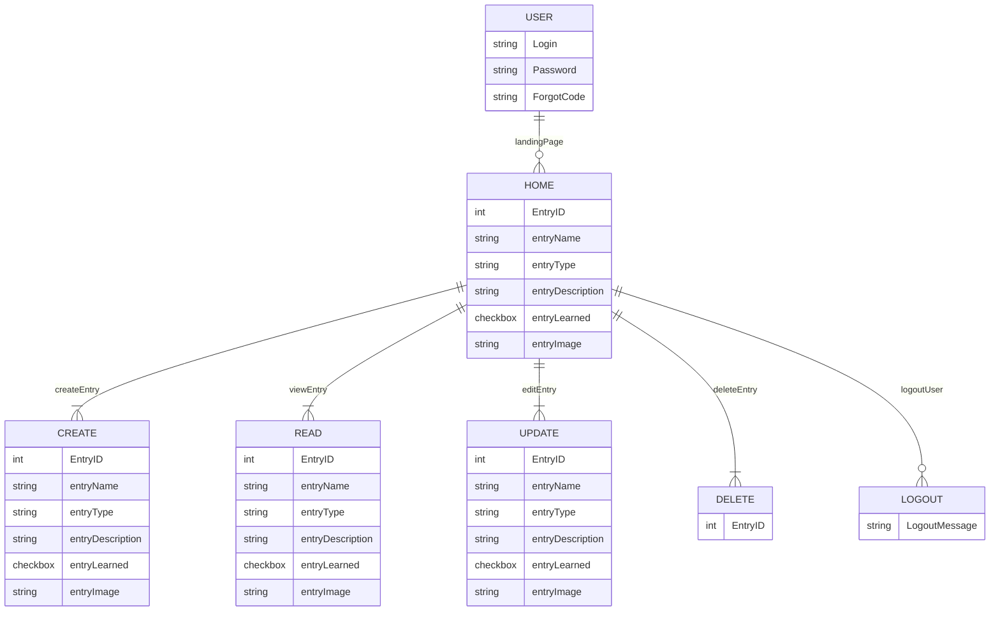

# **Asynq**

## Links
[**Deployed Site**]

[**Icons**](https://icons8.com/icons/color)

[**Trello**](https://trello.com/b/dVAobCJu/asynq)

## Description
- User is able to customize journal entries including automatic date/time per entry, descriptions, and categories. User can cutomize each subject with an icon, with customizable subfolders within an icon. 

## List of Backend Endpoints
|Endpoint|Method|Purpose|
|--------|------|--------|
|/journal|GET|List of journal entries|
|/journal|POST|Create a new journal entry|
|/journal/:id|GET|JSON of journal with id|
|/journal/:id|PUT|Update journal entry|
|/journal/:id|DELETE|Delete journal entry|
|/user/signup|POST|User signup| not yet finished
|/user/login|POST|User login| not yet finished
|/logout|GET|User logout| not yet finished

## ERD Diagram

## Mock Up of UI

## Daily Schedule
|Day|Task|
|---|----|
|1|Complete ERD and Trello to do list|
|2|Complete routes|
|3|Complete seedData|
|4|Create gif play on hover|
|5/6|Create OAuth|
|7|Remaining CSS Styling|

## List of Technologies

<!-- @import "[TOC]" {cmd="toc" depthFrom=1 depthTo=6 orderedList=false} -->
